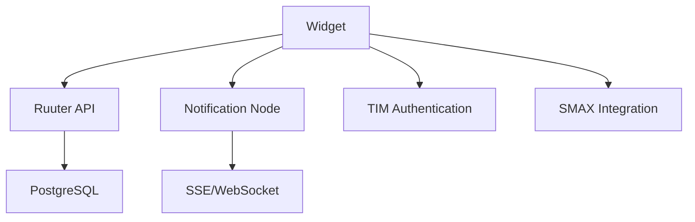
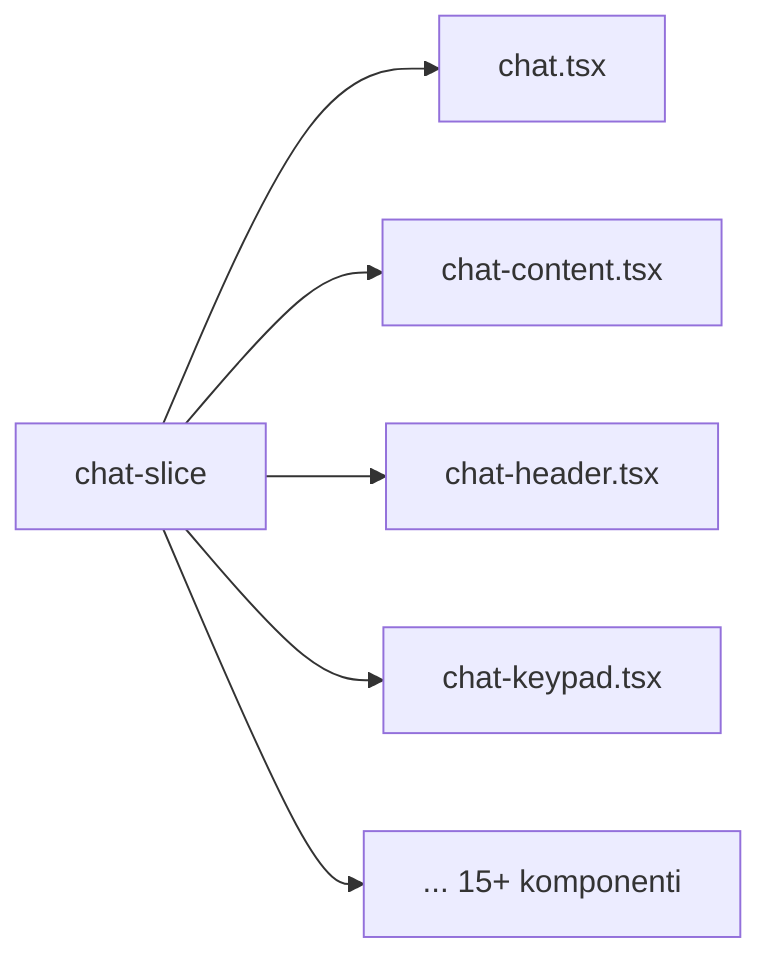

# Arhitektuuri Analüüs

## Praeguse süsteemi ülevaade

### Tehnoloogiline stack

```json
{
  "framework": "React 17.0.2",
  "state": "@reduxjs/toolkit 1.6.2",
  "styling": "styled-components 5.3.3 + PrimeReact 6.6.0",
  "language": "TypeScript 4.4.4",
  "build": "Webpack 5.72.1 + react-scripts 5.0.1",
  "testing": "Jest + Testing Library + MSW"
}
```

### Failistruktuur

```
Chat-Widget/src/
├── components/          # 21 komponenti
│   ├── chat/           # chat.tsx (413 rida)
│   ├── chat-content/
│   ├── chat-header/
│   ├── chat-keypad/
│   ├── chat-message/
│   └── ...
├── slices/             # Redux slices
│   ├── chat-slice.ts   # 1009 rida (PEAMINE PROBLEEM)
│   ├── widget-slice.ts
│   └── authentication-slice.ts
├── services/           # API teenused
│   ├── chat-service.ts
│   ├── http-service.ts
│   └── ...
├── hooks/              # 19 kohandatud hooki
├── utils/              # Utiliidid
├── model/              # TypeScript tüübid
└── mocks/              # MSW mockid
```

---

## Detailne probleemianalüüs

### 1. Olekuhalduse monoliit (chat-slice.ts)

**Probleem**: 1009 rida koodi ühes failis, 22 olekuvälja, 40+ reducerit.

```typescript
// Praegune struktuur - liiga massiivne
export interface ChatState {
  chatId: string | null;
  isChatOpen: boolean;
  chatStatus: CHAT_STATUS | null;
  chatDimensions: { width: number; height: number; };
  isFullScreen: boolean;
  customerSupportId: string;
  lastReadMessageTimestamp: string | null;
  messages: Message[];
  messageQueue: Message[];
  newMessagesAmount: number;
  eventMessagesToHandle: Message[];
  errorMessage: string;
  estimatedWaiting: EstimatedWaiting;
  idleChat: { isIdle: boolean; lastActive: string; };
  loading: boolean;
  showContactForm: boolean;
  showUnavailableContactForm: boolean;
  showAskToForwardToCsaForm: boolean;
  askForContacts: boolean;
  // ... veel 10+ välja
}
```

**Mõju**:
- Raske mõista, milline komponent millist olekut kasutab
- Iga muudatus mõjutab kogu süsteemi
- Testimine on keeruline

**Lahendus**: Jagada feature- slicinguks

```typescript
// Uus struktuur - eraldatud vastutusalad
const useChatMessages = createFeatureSlice('messages');
const useChatUI = createFeatureSlice('ui');
const useChatContacts = createFeatureSlice('contacts');
const useChatFeedback = createFeatureSlice('feedback');
```

---

### 2. Komponentide vastutusala segadus

**Probleem**: `chat.tsx` (413 rida) sisaldab:
- UI renderdamist
- Äriloogikat
- API kutseid
- Sündmuste käsitlust
- Animatsioone

```typescript
// Praegune chat.tsx - liiga palju vastutust
const Chat = () => {
  // 1. UI olek
  const [showWidgetDetails, setShowWidgetDetails] = useState(false);
  const [showFeedbackResult, setShowFeedbackResult] = useState(false);

  // 2. Redux olek
  const { isChatEnded, chatId, messageQueue, idleChat, ... } = useChatSelector();

  // 3. API andmed
  const { widgetConfig } = useWidgetSelector();

  // 4. Külgmõjud
  useEffect(() => { /* idle timer */ }, [idleChat]);
  useEffect(() => { /* message queue */ }, [messageQueue]);
  useEffect(() => { /* greeting */ }, [chatId]);
  // ... veel 10+ useEffect

  // 5. Renderdamine
  return (
    <Resizable>
      <ChatHeader />
      <ChatContent />
      {/* ... palju tingimuslikku renderdamist */}
    </Resizable>
  );
};
```

**Lahendus**: Container/Presenter muster + Custom Hooks

```typescript
// Uus lähenemine - selge eraldus
const ChatContainer = () => {
  // Ainult andmete hankimine ja sündmuste käsitlus
  const { messages, sendMessage, endChat } = useChatFeature();
  return <ChatView messages={messages} onSend={sendMessage} onEnd={endChat} />;
};

const ChatView = ({ messages, onSend, onEnd }) => {
  // Ainult renderdamine
  return <>{/* puhas JSX */}</>;
};
```

---

### 3. Globaalne konfiguratsioon (window._env_)

**Probleem**: TypeScripti laiendamine globaalselt, testimise raskused.

```typescript
// Praegune lähenemine - globaalne mutatsioon
declare global {
  interface Window {
    _env_: {
      RUUTER_API_URL: string;
      NOTIFICATION_NODE_URL: string;
      // ... 15+ välja
    };
  }
}

// Kasutamine läbi koodi
http.post(window._env_.RUUTER_API_URL + '/endpoint');
```

**Lahendus**: Dependency Injection + Context

```typescript
// Uus lähenemine - konfigureeritav, testitav
interface WidgetConfig {
  api: {
    ruuterUrl: string;
    notificationUrl: string;
  };
  features: {
    authentication: boolean;
    fileUpload: boolean;
  };
}

const ConfigContext = createContext<WidgetConfig | null>(null);

// Testides saab injectida mock configi
const wrapper = ({ children }) => (
  <ConfigContext.Provider value={mockConfig}>
    {children}
  </ConfigContext.Provider>
);
```

---

### 4. Külgmõjude laialivalgumine (useEffect)

**Probleem**: App.tsx sisaldab 15+ useEffect hook'i.

```typescript
// Praegune App.tsx - useEffect püramiid
const App = () => {
  // 1. Widget config
  useInterval(() => dispatch(getWidgetConfig()), onlineCheckInterval);

  // 2. Office hours
  useInterval(() => setDisplayWidget(isOfficeHours()), OFFICE_HOURS_INTERVAL_TIMEOUT);

  // 3. Session management
  useEffect(() => { initializeSession(); }, []);

  // 4. Storage sync
  useEffect(() => {
    window.addEventListener('storage', storageHandler);
    return () => window.removeEventListener('storage', storageHandler);
  }, []);

  // 5. JWT extend
  useLayoutEffect(() => { /* JWT extend interval */ }, [messages]);

  // ... veel 10+ useEffect
};
```

**Lahendus**: Composite Hooks Pattern

```typescript
// Uus lähenemine - komponeeritud hookid
const useWidgetLifecycle = () => {
  useWidgetConfigRefresh();
  useOfficeHoursCheck();
  useSessionManager();
  useJwtRefresh();
  useStorageSync();
};

const App = () => {
  useWidgetLifecycle();
  return <WidgetUI />;
};
```

---

### 5. Stiilide segadus

**Praegune olukord**:
- styled-components runtime overhead
- PrimeReact komponendid koos custom styled komponentidega
- Inline stiilid segatud CSS failidega
- SCSS failid paralleelselt styled-components'iga

**Bundle mõju**:
```
styled-components: ~45KB (gzipped)
PrimeReact + icons: ~80KB (gzipped)
```

**Lahendus**: CSS Modules + Tailwind + Headless UI

```
Tailwind CSS: ~10KB (purged)
Headless UI: ~15KB
Kokku: ~60% väiksem
```

---

## Sõltuvuste analüüs

### Välised sõltuvused



### Sise-killustumine



**Probleem**: Kõik sõltuvad ühest monoliitsesest olekust.

---
